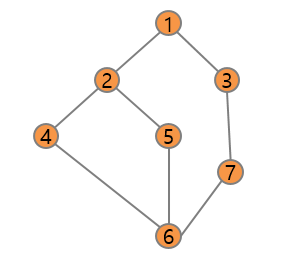

(1) 큐(queue) 자료구조의 특징을 간단히 설명하시오.  
큐에 삽입한 순서대로 원소가 저장되어 가장먼저 삽입 된 원소가 가장 먼저 삭제되는 선입선출(First in Fist out, FIFO)의 자료구조

(2) 너비우선탐색(BFS)에 대해 간단히 설명하시오.  
시작점의 인접한 정점들을 먼저 모두 차례로 방문하고 방문했던 정점을 시작점으로 하여 다시 인점한 정점들을 차례로 방문하는 탐색 방식이며 큐를 이용한다.  

(3) 다음 그래프를 1번 정점부터 너비우선탐색으로 탐색한 경우 1 2 3 4 5 7 6 순서로 방문하게 된다. 4번 정점부터 BFS로 탐색하는 경우의 방문 순서를 표시하고, 1번 정점을 방문하기 까지의 과정을 간단히 설명하시오. (인접 정점 중 빠른 번호를 선택하는 규칙을 적용한 경우)  
4-2-6-1-5-7-3

