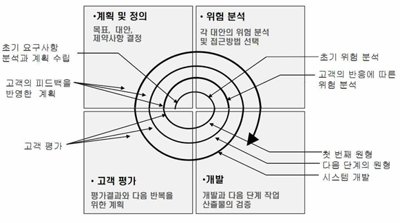

### 나선형 모형 (점진적 모형)
나선형 모형은 보헴(Boehm)이 제안한 것으로, 폭포수 모형과 프로토타입 모형의 장점에 위험 분석 기능을 추가한 모형이다.

- 나선을 따라 돌듯이 여러 번의 소프트웨어 개발 과정을 거쳐 점진적으로 완벽한 최종 소프트웨어를 개발하는 모형
- 소프트웨어를 개발하면서 발생할 수 있는 위험을 관리하고 최소화하는 것을 목적으로 한다.
- 점진적으로 개발 과정이 반복되므로 누락되거나 추가된 요구사항을 첨가할 수 있고, 정밀하며, 유지 보수 과정이 필요 없다.

계획 수립 &rarr; 위험 분석 &rarr; 공학적 개발 &rarr; 고객 평가 &rarr; (다음) 계획 수립