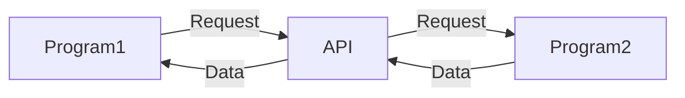

### API (Application Programming Interface)
- 응용 프로그램에서 사용할 수 있도록, 운영체제나 프로그래밍 언어가 제공하는 기능을 제어할 수 있게 만든 인터페이스
- 어떤 특정 사이트에서 특정 데이터를 공유할 경우 어떠한 방식으로 정보를 요청해야 하는지, 어떠한 데이터를 제공 받을 수 있을지에 대한 규격을 정해놓은 인터페이스

> 전국 우산 판매 프로그램 개발 시 API 활용 사례
> 1. 개발 중인 전국 우산 판매 프로그램에서 해당 API에 날짜/지역 정보를 전달
> 2. 해당 API에서 날씨 정보를 응답
> 3. 개발자가 날씨 정보를 표출하도록 지정한 위치에 기상청의 API를 통해 제공 받은 날씨 정보를 표출
