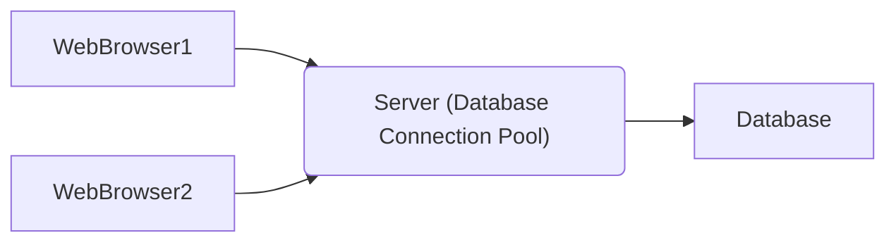

### 커넥션 풀 (Connection Pool)
- 데이터베이스와 연결된 커넥션을 미리 만들어서 풀(Pool) 속에 저장해 두고 필요할 때 커넥션을 풀에서 가져다가 쓰고 다시 풀에 반환하는 기법

- 데이터베이스에 연결하기 위해서 매번 커넥션(Connection) 객체를 생성할 때마다 많은 시스템 자원이 소요되는 문제 해결을 위해 커넥션 풀 기법을 활용
