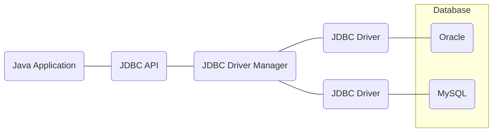

### JDBC (Java Database Connectivity)
- 데이터베이스에서 자료를 조회하거나 업데이트하기 위해서 자바에서 데이터베이스에 접속할 수 있도록 하는 자바 API
- Java Application, JDBC API, JDBC Driver Manager, JDBC Driver로 구성되어 있다

<table>
<tr>
<th>구성요소</th>
<th>설명</th></tr>
<tr>
<td>Java Application</td>
<td>네이티브 자바, 자바 서블릿, 자바 응용 프로그램</td>
</tr>
<tr>
<td>JDBC API</td>
<td>자바 응용 프로그램에서 DB를 연결하고 데이터를 제어할 수 있도록 DB 연결 및 제어를 위한 인터페이스와 클래스들을 제공</td></tr>
<tr>
<td>JDBC Driver Manager</td><td>자바 응용 프로그램이 사용하는 데이터베이스에 맞는 드라이버 검색, 연결 및 초기화 수행</td></tr>
<tr><td>JDBC Driver</td><td>- 각 데이터베이스 제작 업체(Oracle, MySQL 등)에서 만든 데이터베이스 드라이버 
- 자바 프로그램의 요청을 DBMS가 이해할 수 있는 프로토콜로 변환해주는 클라이언트 사이드 어댑터</td></tr></table>