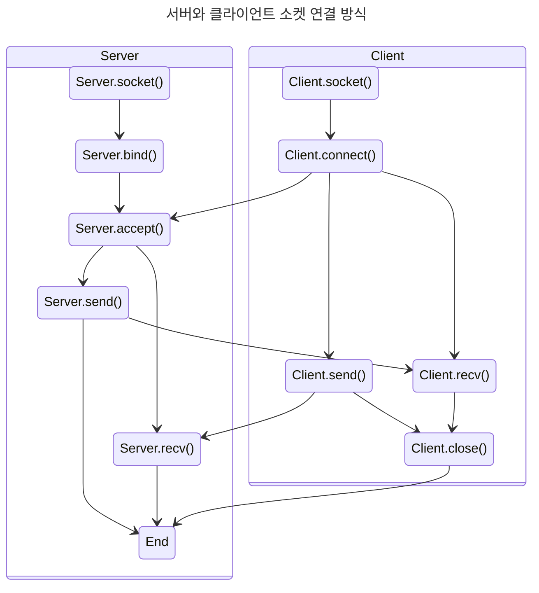
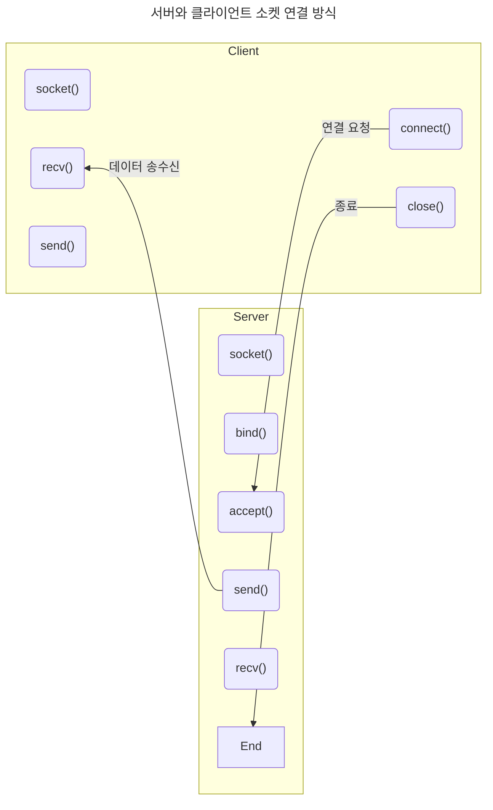

### 소켓 (Socket)
- IP 주소와 Port 번호가 합쳐진, 네트워크상에서 서버 프로그램과 클라이언트 프로그램이 통신할 수 있도록 해주는 교환 기술
- 두 소켓이 연결되면 서로 다른 프로세스끼리 데이터를 전달할 수 있음
- 두 소켓이 연결된 것을 세션(Session)이라고 한다

```mermaid
---
title: 서버와 클라이언트 소켓 연결 방식
---
stateDiagram-v2
    state Server {
        Server.socket() --> Server.bind()
        Server.bind() --> Server.accept()
        Server.accept() --> Server.send()
        Server.accept() --> Server.recv()
        Server.send() --> End
        Server.recv() --> End
    }
    state Client {
        Client.socket() --> Client.connect()
        Client.connect() --> Client.send()
        Client.connect() --> Client.recv()
        Client.send() --> Client.close()
        Client.recv() --> Client.close()
    }
    Client.connect() --> Server.accept()
    Server.send() --> Client.recv()
    Client.send() --> Server.recv()
    Client.close() --> End
```

```mermaid
---
title: 서버와 클라이언트 소켓 연결 방식
---
graph RL
    subgraph Server
        s1("socket()")
        s2("bind()")
        s3("accept()")
        s4("send()")
        s5("recv()")
        End
    end
    subgraph Client 
        c1("socket()")
        c2("connect()")
        c3("recv()")
        c4("send()")
        c5("close()")
    end
    c2 --> |"연결 요청"|s3
    s4 --> |"데이터 송수신"|c3
%%    c4 --> |"데이터 전송"|s5
    c5 --> |종료|End
```