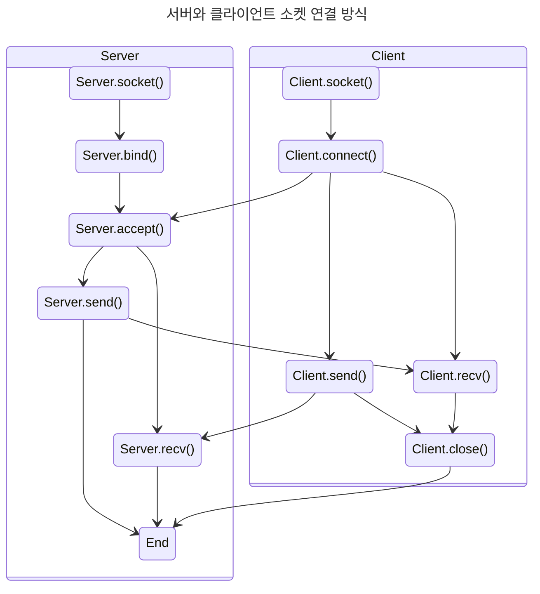

### 소켓 (Socket)
- IP 주소와 Port 번호가 합쳐진, 네트워크상에서 서버 프로그램과 클라이언트 프로그램이 통신할 수 있도록 해주는 교환 기술
- 두 소켓이 연결되면 서로 다른 프로세스끼리 데이터를 전달할 수 있음
- 두 소켓이 연결된 것을 세션(Session)이라고 한다

1. 서버 소켓과 클라이언트 소켓을 만듦(socket())
2. 서버 소켓은 로컬 IP를 가지고 포트를 열고(bind()), 클라이언트 연결을 기다림(listen())
3. 클라이언트 소켓은 IP 주소를 이용해 목적지 호스트를 찾아내고 포트를 이용해 통신 접속점을 찾아내서 연결을 만듦(connect())
4. 서버 소켓이 연결을 수락하면(accept()), 포트를 이용해 데이터를 주고받음(send(), recv())
