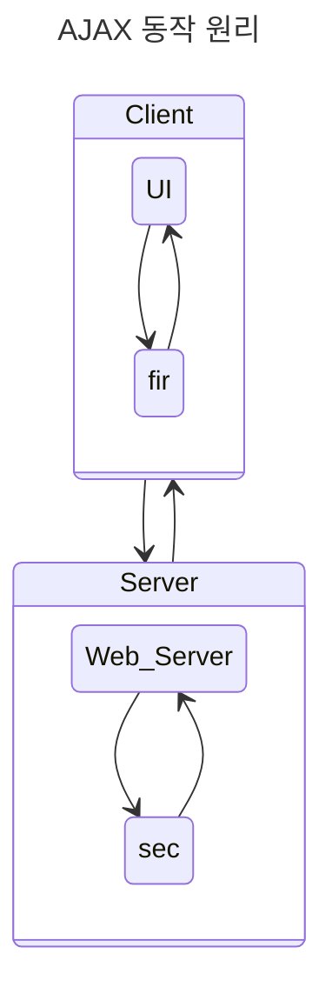

# 인터페이스

### 인터페이스 기능 구현 기술

### JSON (Javascript Object Notation)

- 속성-값(Attribute-Value Pair) 쌍 또=는 "키-값 쌍"으로 이루어진 데이터 오브젝트를 전달하기 위해 인간이 읽을 수 있는 텍스트를 사용하는 개방형 표준 포맷
- AJAX(Asynchronous JavaScript and XML)에서 많이 사용되고 XML(eXtensible Markup Language)을 대체하는 주요 데이터 포맷
- 언어 독립형 데이터 포맷으로 다양한 데이터 프로그래밍 언어에서 사용 가능
- 사람이 읽고 쓰기에 용이하며, 기계가 분석하고 생성하기에도 용이

### JSON 표현 자료형

- 숫자(number)
    - 기본 자료형의 수는 정수, 실수(고정소수점), 실수(부동소수점)로 표현
    - 74, 3.14, 3.4 e+4
- 문자열(String)
    - 항상 큰 따옴표(" ")로 묶어야 하며, 그 안에는 유니코드 문자들이 나열
    - "ABCD", "1234"
- 배열(Array)
    - 배열은 대괄호[]로 표시. 배열의 각 요소는 기본 자료형이거나 배열, 객체이다
    - 각 요소들은 쉼표(,)로 구별되고 각 요소가 나타나는 순서에 의미가 있다
    - ["malrangcow", {"favorite": "choonsik"}, [00, "male"]]
- 객체(Object)
    - 객체는 이름/값 쌍의 집합으로 표현되며, 객체는 중괄호{}로 표시
    - 이름은 문자열이기 때문에 반드시 따옴표를 사용해야 하며, 값은 기본 자료형이다
    - 이름과 값은 콜론(:)으로 구분되고, 각 이름/값 쌍은 쉼표(,)로 구별
    - 각 쌍들이 나오는 순서들은 의미가 없다
    - {"malrangcow": 2000, "choonsik": 2020}

### JSON Grammar

- 구조
    - name/value 쌍으로 구성
    - '{'로 시작하고 '}'로 끝남
    - 배열은 대괄호[]로 나타낸다

```json
{
  "name": "malrangcow",
  "birth": 2000,
  "gender": "male",
  "favorite": "choonsik",
}
```
  
### XML (eXtensible Markup Language)
- HTML의 단점을 보완한 인터넷 언어로, SGML의 복잡한 단점을 개선한 특수한 목적을 갖는 마크업 언어
- 송/수신 시스템 간 데이터 연계의 필요성을 위해서 전송되는 데이터 구조를 동일한 형태로 정의
- 인간과 기계가 모두 이해할 수 있는 텍스트 형태로 마크업 포맷을 정의하기 위한 메타 언어(대상을 직접 서술하는 언어)
- 사용자가 직접 문서의 태그를 정의 가능, 다른 사용자가 정의한 태그를 재사용할 수 있다

```xml
<!--1.0버전의 XML로 작성된 문서로 euc-kr 언어셋을 사용, XML 문서의 해석 시 외부 문서 참조-->
<?xml version="1.0" encoding="euc-kr" standalone="no"?>
<!--<blog> 요소의 시작점, XML 문서에 하나만 존재하는 root 요소로 'name' 속성을 가진다-->
<blog name="CS">
    <!--'post' 요소의 시작점, 'id', 'title', 'content' 속성을 가진다-->
    <post>
        <!--각 요소에 값 저장-->
        <id>1</id>
        <title>About Choonsik</title>
        <content>Choonsik is a cat</content>
    </post>
    <post>
        <id>2</id>
        <title>About Malrangcow</title>
        <content>Malrangcow is not a cow</content>
    </post>
</blog>
```

### AJAX (Asynchronous JavaScript and XML)
- 자바스크립트를 사용하여 웹 서버와 클라이언트 간 비동기적으로 XML 데이터를 교환하고 조작하기 위한 웹 기술
- 브라우저가 가지고 있는 XMLHttpRequest 객체를 이용하여 전체 페이지를 새로 로드하지 않고 필요한 일부 페이지의 데이터만을 로드하는 기법
- 하이퍼 텍스트 표기 언어(HTML)만으로는 어려운 다양한 작업을 웹 페이지에서 구현하여 이용자가 웹 페이지와 자유롭게 상호 작용할 수 있도록 구현하는 기법

### AJAX 주요 기술
- XMLHttpRequest
  - 웹 브라우저와 웹 서버 간 메서드가 데이터를 전송하는 객체 폼의 API
  - 비동키 통신을 담당하는 자바스크립트 객체
- JavaScript
  - 객체 기반의 스크립트 프로그래밍 언어
  - 웹 브라우저 내에서 주로 사용하며, 다른 응용 프로그램의 내장 객체에도 접근할 수 있는 기능 소유
- XML (eXtensible Markup Language)
  - HTML의 단점을 보완한 인터넷 언어로서 SGML의 복잡한 단접을 개선한 특수한 목적을 갖는 마크업 언어
- DOM (Document Object Model)
  - XML 문서를 트리 구조의 형태로 접근할 수 있게 해주는 API
  - 플랫폼/언어 중립적으로 구조화된 문서를 표현하는 객체 지향 모델
- XSLT (eXtensible Stylesheet Language Transformations)
  - XML 문서를 다른 XML 문서로 변환하는 데 사용하는 XML 기반 언어
  - W3C에서 제정한 표준으로 XML 변환 언어를 사용하여 XML 문서로 바꿔주며, 탐색하기 위해 XPath를 사용
- HTML (HyperText Markup Language)
  - 인터넷 웹(WWW) 문서를 표현하는 표준화된 마크업 언어
- CSS (Cascading Style Sheets)
  - 마크업 언어가 실제 표시되는 방법을 기술하는 언어
  - 운영체제나 사용 프로그램과 관계없이 글자 크기, 글자체, 줄 간격, 색상 등을 자유롭게 선택할 수 있는 스타일 시트



```mermiad
graph TD
    A[사용자 인터페이스] -->|사용자 요청| B[HTTP Request 요청/응답]
    B-->C[백엔드 서버]
    C -->|데이터베이스 서비스 쿼리| D[데이터베이스]
    C -->|HTML, JSON 응답| A
    D -->|쿼리 결과| C
    A -->|HTML 렌더링| E[화면 표시]
```