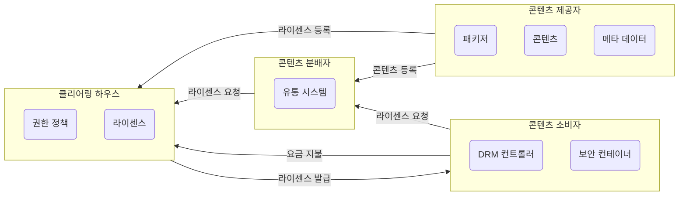

### 저작권
- 소설, 시, 논문, 강연, 연술, 음악, 연극, 무용, 회화, 서예, 건축물, 사진, 영상, 지도, 도표, 컴퓨터 프로그램 저작물 등에 대하여 창작자가 가지는 배타적 독점 권리로, 타인의 침해를 받지 않을 고유한 권한
- 컴퓨터 프로그램들과 같이 복제하기 쉬운 저작물에 대해 불법 복제 및 배포 등을 막기 위한 기술적인 방법을 통칭해 저작권 보호 기술이라 한다

### 디지털 저작권 권리 (DRM; Digital Rights Management)
- 저작권자가 배포한 디지털 콘텐츠가 저작권자가 의도한 용도로만 사용되도록 디지털 콘텐츠의 생성, 유통, 이용까지의 전 과정에 걸쳐 사용되는 디지털 콘텐츠 관리 및 보호 기술
- 원본 콘텐츠가 아날로그인 경우에는 디지털로 변환한 후 패키저(Packager)로 DRM 패키징을 수행
- 패키징을 수행하면 콘텐츠에는 암호화된 저작권자의 전자서명이 포함되고, 저작권자가 설정한 라이센스 정보가 클리어링 하우스(Clearing House)에 등록된다

### 디지털 저작권 관리의 흐름 및 구성 요소

